---

### Um pouco sobre mim

- 🏫 Graduando em Ciência da Computação – **UFMG**
- 🎓 Técnico em Informática – **CEFET-MG**
- 💻 Interessando am algoritmos, algebra linear, desenvolvimento web e sistemas

Nos links fixados pode me encontrar em outras redes e descobrir mais sobre mim.

#

  
  

<picture>
  <source media="(prefers-color-scheme: dark)" srcset="https://raw.githubusercontent.com/El0y-C0SM0/El0y-C0SM0/output/github-contribution-grid-snake-dark.svg" />
  <source media="(prefers-color-scheme: light)" srcset="https://raw.githubusercontent.com/El0y-C0SM0/El0y-C0SM0/output/github-contribution-grid-snake.svg" />
  
</picture>

<!--  -->                              

#

### Stacks: 

  
  
  
  
  
  
  
  
  
  

### Ferramentas e Ambientes: 

 
  
  
  
  
  
  
<!--
  
<!--    -->
  
<!--    -->

   

#

### Confira meus principais projetos fixados.

No entanto sinta-se livre para explorar outros dos meus repositórios, neles encontrará um arcervo de exercicios e projetos que acompanham minha jornada de profissional e de aprendizado. 

<!--
- [Casa do Hobbit](https://el0y-c0sm0.github.io/Casa-do-Hobbit/)
- [Chess](https://edu15076.github.io/xadrez/)
- [RPG Tools - Dice Bot](https://el0y-c0sm0.github.io/rpg-tools-dice-bot/site)
- [Cosmos-Owl](https://github.com/El0y-C0SM0/Cosmos-Owl)
-->

